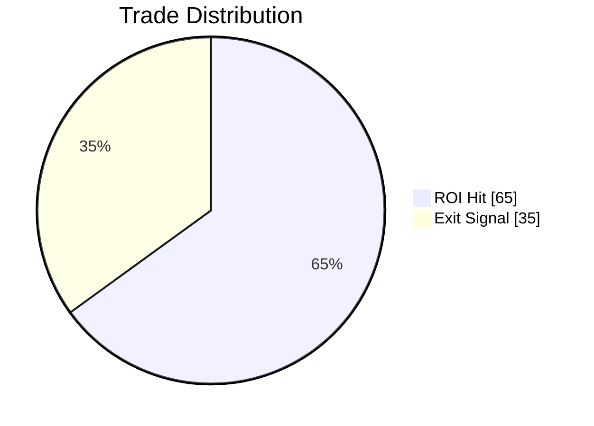

# AI Chart Renderer Integration Guide

## Manual Steps Required

### 1. Install mermaid.js dependency
```bash
cd frontend
npm install
```

### 2. Integrate chart renderer into AssistantChatPanel.jsx

Add this import at the top of `AssistantChatPanel.jsx`:
```jsx
import {
  MermaidDiagram,
  StructuredChart,
  ChartImage,
  renderMessageWithCharts,
} from "./AIChartRenderer.jsx";
```

Replace the existing `renderMessageWithCode` function calls with `renderMessageWithCharts`:

In the message rendering section (around line 91-147), replace:
```jsx
function renderMessageWithCode(content) {
  // ... existing code ...
}
```

With:
```jsx
// Use the new chart-aware renderer
const segments = renderMessageWithCharts(content);
```

Then update the segment rendering to handle chart types:
```jsx
return segments.map((segment, idx) => {
  if (segment.type === 'mermaid') {
    return <MermaidDiagram key={`mermaid-${idx}`} code={segment.content} />;
  }
  if (segment.type === 'chart') {
    return <StructuredChart key={`chart-${idx}`} chartData={segment.data} />;
  }
  if (segment.type === 'code') {
    return <CodeBlock key={`code-${idx}`} language={segment.language} content={segment.content} />;
  }
  return <span key={`text-${idx}`}>{renderContent(segment.content)}</span>;
});
```

## What the AI Can Now Generate

### 1. ASCII Charts (Text-based)
```
BTC/USDT:  ████████████████████████████████████ +15.2%
ETH/USDT:  ████████████ -3.4%
```

### 2. Mermaid Diagrams


### 3. Structured Chart Data (JSON)
```json
{
  "chartType": "bar",
  "title": "Pair Performance",
  "data": [
    {"label": "BTC/USDT", "value": 15.2, "color": "#059669"},
    {"label": "ETH/USDT", "value": -3.4, "color": "#ef4444"}
  ]
}
```

### 4. Backend Chart Images
The AI can request chart generation via the `/api/ai/generate-chart` endpoint for complex visualizations.

## Testing

After integration, test by:
1. Running a backtest
2. Clicking "Analyze Result"
3. The AI should now include charts in its response using the new formats
